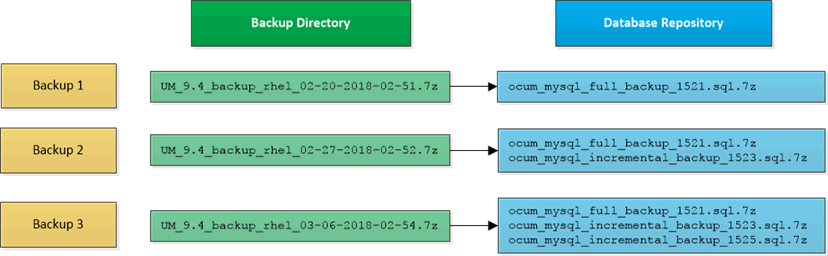

= Sichern und Wiederherstellen mithilfe eines MySQL Datenbank-Dump
:allow-uri-read: 
:icons: font
:imagesdir: ../media/

[role="lead"]
Ein MySQL Datenbank Dump Backup ist eine Kopie der Active IQ Unified Manager-Datenbank und Konfigurationsdateien, die Sie im Falle eines Systemausfalls oder Datenverlust verwenden können. Sie können ein Backup so planen, dass es auf ein lokales Ziel oder auf ein Remote-Ziel geschrieben wird. Es wird dringend empfohlen, einen Remote-Standort außerhalb des Active IQ Unified Manager Host-Systems zu definieren.

[NOTE]
====
MySQL Datenbank Dump ist der Standard-Backup-Mechanismus, wenn Unified Manager auf einem Linux- und Windows-Server installiert ist. Für Red hat Enterprise Linux, CentOS Linux Systeme oder Windows können Sie die Backup-Methode von NetApp Snapshot verwenden, wenn Active IQ Unified Manager eine große Anzahl von Clustern und Knoten managt oder wenn Ihre MySQL Backups mehrere Stunden in Anspruch nehmen.

====
Ein Datenbank-Dump-Backup besteht aus einer einzelnen Datei im Sicherungsverzeichnis und einer oder mehreren Dateien im Datenbank-Repository-Verzeichnis. Die Datei im Backup-Verzeichnis ist sehr klein, da sie nur einen Zeiger auf die Dateien enthält, die sich im Datenbank-Repository-Verzeichnis befinden und für die Wiederherstellung des Backups benötigt werden.

Beim ersten Generieren einer Datenbanksicherung wird im Backup-Verzeichnis eine einzelne Datei erstellt und im Datenbank-Repository-Verzeichnis eine vollständige Sicherungsdatei erstellt. Wenn Sie das nächste Mal ein Backup erstellen, wird im Backup-Verzeichnis eine einzelne Datei erstellt und im Datenbank-Repository-Verzeichnis eine inkrementelle Sicherungsdatei erstellt, die die Unterschiede zur vollständigen Backup-Datei enthält. Dieser Prozess wird bei der Erstellung zusätzlicher Backups bis zur Einstellung für maximale Aufbewahrung fortgesetzt, wie in der folgenden Abbildung dargestellt.

[NOTE]
====
Benennen Sie die Sicherungsdateien in diesen beiden Verzeichnissen nicht um, oder entfernen Sie sie nicht. Bei einem späteren Wiederherstellungsvorgang schlägt dies fehl.

====
Wenn Sie Ihre Sicherungsdateien in das lokale System schreiben, sollten Sie einen Prozess starten, um die Backup-Dateien an einen Remote-Standort zu kopieren, damit sie verfügbar sind, falls Sie ein Systemproblem haben, das eine vollständige Wiederherstellung erfordert.

Vor Beginn eines Backup-Vorgangs führt Active IQ Unified Manager eine Integritätsprüfung durch, um zu überprüfen, ob alle erforderlichen Backup-Dateien und Backup-Verzeichnisse vorhanden sind und beschreibbar sind. Außerdem wird überprüft, ob genügend Speicherplatz auf dem System vorhanden ist, um die Backup-Datei zu erstellen.
