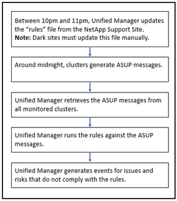

= Generieren von Active IQ-Plattformereignissen
:allow-uri-read: 
:icons: font
:imagesdir: ../media/

[role="lead"]
Ereignisse und Risiken auf Active IQ Plattformen werden wie in der folgenden Abbildung dargestellt in Unified Manager Ereignisse konvertiert.

Wie Sie sehen, wird die auf der Active IQ-Plattform kompilierte Regeldatei aktuell, Cluster-AutoSupport-Meldungen werden täglich generiert und Unified Manager aktualisiert die Liste der Ereignisse täglich.
