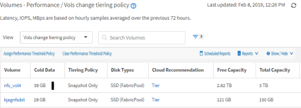

= Schnellstartanleitung für die Berichterstellung
:allow-uri-read: 
:icons: font
:imagesdir: ../media/

[role="lead"]
Erstellen Sie einen benutzerdefinierten Beispielbericht, um Ansichten zu untersuchen und Berichte zu planen. Dieser Schnellstart-Bericht enthält eine Liste der Volumes, die Sie möglicherweise auf das Cloud-Tier verschieben möchten, da es eine Menge inaktiver (kalter) Daten gibt. Sie öffnen die Ansicht „Leistung: Alle Volumes“, passen die Ansicht mit Filtern und Spalten an, speichern die benutzerdefinierte Ansicht als Bericht und planen den Bericht für die Freigabe einmal pro Woche.

== Bevor Sie beginnen

* Sie müssen über die Rolle „Anwendungsadministrator“ oder „Speicheradministrator“ verfügen.
* Sie müssen FabricPool Aggregate konfiguriert haben und Volumes auf diesen Aggregaten haben.

== Über diese Aufgabe

Befolgen Sie die nachstehenden Schritte:

* Öffnen Sie die Standardansicht
* Passen Sie die Spalten an, indem Sie die Daten filtern und sortieren
* Speichern Sie die Ansicht
* Planen eines Berichts für die benutzerdefinierte Ansicht

== Schritte

. Klicken Sie im linken Navigationsbereich auf *Storage* > *Volumes*.
. Wählen Sie im Menü Ansicht die Option *Leistung* > *Alle Volumes*.
. Klicken Sie auf *ein-/Ausblenden*, um sicherzustellen, dass die Spalte "`DFestplatten-Typen`" in der Ansicht angezeigt wird.
+
image::../media/show-hide-3.png[Ausblenden 3 anzeigen]

+
Fügen Sie weitere Spalten hinzu oder entfernen Sie diese, um eine Ansicht zu erstellen, die die für Ihren Bericht wichtigen Felder enthält.

. Ziehen Sie die Spalte „`Disk types`“ neben der Spalte „`Cloud Recommendation`“.
. Klicken Sie auf das Filtersymbol, um die folgenden drei Filter hinzuzufügen, und klicken Sie dann auf *Filter anwenden*:
+
** Festplattentypen enthalten FabricPool
** Cloud-Empfehlung enthält Tier
** Kalte Daten größer als 10 GBimage:../media/filter-cold-data-2.png[""]

+
Beachten Sie, dass jeder Filter mit einem logischen verbunden ist, damit alle zurückgegebenen Volumes alle Kriterien erfüllen müssen. Sie können maximal fünf Filter hinzufügen.

. Klicken Sie oben in der Spalte *Cold Data*, um die Ergebnisse so zu sortieren, dass die Volumes mit den meisten kalten Daten oben in der Ansicht erscheinen.
. Wenn die Ansicht angepasst ist, lautet der Ansichtsname *nicht gespeicherte Ansicht*. Benennen Sie die Ansicht, mit der die Ansicht dargestellt wird, z. B. „`Vols change Tiering Policy`“. Wenn Sie fertig sind, klicken Sie auf das Häkchen oder drücken Sie *Enter*, um die Ansicht mit dem neuen Namen zu speichern.
+

. Laden Sie den Bericht als *CSV*-, *Excel*- oder *PDF*-Datei herunter, um die Ausgabe anzuzeigen, bevor Sie sie planen oder freigeben.
+
Öffnen Sie die Datei mit einer installierten Anwendung, z. B. Microsoft Excel (CSV oder Excel) oder Adobe Acrobat (PDF), oder speichern Sie die Datei.

+
[NOTE]
====
Sie können Ihren Bericht mithilfe komplexer Filter, Sortierungen, Pivot-Tabellen oder Diagramme weiter anpassen, indem Sie die Ansicht als Excel-Datei herunterladen. Nachdem Sie die Datei in Excel geöffnet haben, können Sie den Bericht mithilfe der erweiterten Funktionen anpassen. Wenn Sie zufrieden sind, laden Sie die Excel-Datei hoch. Diese Datei mit den zugehörigen Anpassungen wird bei der Ausführung des Berichts auf die Ansicht angewendet.

====
+
Weitere Informationen zum Anpassen von Berichten mithilfe von Excel finden Sie unter _Beispiel Microsoft Excel-Berichte_.

. Klicken Sie auf der Bestandsseite auf die Schaltfläche *geplante Berichte*. Alle geplanten Berichte, die sich auf das Objekt beziehen, werden in diesem Fall in der Liste angezeigt.
+
image::../media/scheduled-reports-3.gif[Geplante Berichte 3]

. Klicken Sie auf *Zeitplan hinzufügen*, um der Seite *Berichtspläne* eine neue Zeile hinzuzufügen, damit Sie die Terminplaneigenschaften für den neuen Bericht definieren können.
. Geben Sie einen Namen für den Bericht ein, und füllen Sie die anderen Berichtsfelder aus, und klicken Sie dann auf das Häkchen (image:../media/blue-check.gif[""]Am Ende der Reihe.
+
Der Bericht wird sofort als Test gesendet. Danach wird der Bericht generiert und per E-Mail an die Empfänger gesendet, die unter der angegebenen Häufigkeit aufgeführt sind.

+
Der folgende Beispielbericht wird im CSV-Format erstellt:

+
image::../media/csv-sample-report.gif[csv-Beispielbericht]

+
Der folgende Beispielbericht ist im PDF-Format verfügbar:

+
image::../media/pdf-sample-report.gif[pdf-Beispielbericht]

== Nachdem Sie fertig sind

Basierend auf den im Bericht gezeigten Ergebnissen sollten Sie möglicherweise ONTAP System Manager oder die ONTAP CLI verwenden, um die Tiering-Richtlinie in „`Auto`“ oder „`all`“ zu ändern, damit bestimmte Volumes weniger häufig benötigte Daten auf Cloud-Tier verlagern.
